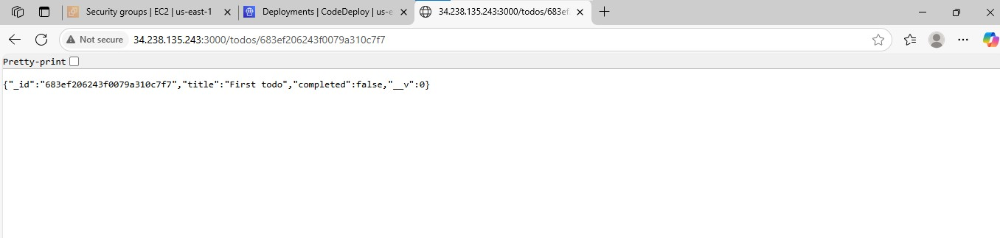

# Multi-Container Todo App with Docker Compose
A simple **Node.js + MongoDB Todo API** deployed using **Docker Compose, Terraform, Ansible, and GitHub Actions**. This project demonstrates how to build and deploy a simple todo list application.

## Features
1. Create, Read, Update, Delete (CRUD) Todo items
2. Dockerized Node.js API and MongoDB database
3. Multi-container setup using Docker Compose
4. Infrastructure as Code (IaC) with Terraform
5. Remote provisioning with Ansible
6. CI/CD pipeline with GitHub Actions
7. Persistent data using Docker volumes

## Tech Stack
1. Node.js + Express.js
2. MongoDB + Mongoose
3. Docker + Docker Compose
4. Terraform
5. Ansible
6. GitHub Actions
7. Cloud Provider -AWS

## Directory Structure

```text
multicontainer-todo-app/
├── server/                            # Node.js Todo API
│   ├── models/
│   │   └── Todo.js                   # Mongoose model
│   ├── routes/
│   │   └── todos.js                  # All route handlers
│   ├── app.js                        # Express app setup
│   ├── server.js                     # Entry point
│   ├── package.json
│   ├── package-lock.json
│   └── Dockerfile                    # Docker config for API
│
├── docker-compose.yml                # Compose config for API + MongoDB
├── .env                              # Environment variables
│
├── terraform/                        # Infra provisioning
│   ├── main.tf                       # Main infra definition
│   ├── variables.tf                  # Input variables
│   ├── outputs.tf                    # Output IP, etc.
│   └── terraform.tfvars              # Variable values
│
├── ansible/                          # Remote server configuration
│   ├── inventory.ini                 # Target server IP
│   ├── playbook.yml                  # Main playbook
│   └── roles/
│       └── docker/
│           ├── tasks/
│           │   └── main.yml          # Docker install/configure
│           └── handlers/
│               └── main.yml
│
├── .github/                          # GitHub Actions CI/CD
│   └── workflows/
│       └── deploy.yml                # CI/CD pipeline
│
├── README.md
```
## Steps to Run Locally

### 1.Clone the repository

    git clone https://github.com/suchithrachandrasekaran/multicontainer-todo-app.git
    cd multicontainer-todo-app
    
### 2.Build and start the containers

    docker compose up --build

### 3.Access the API

Visit: http://localhost:3000/todos

## Steps to Deploy Remotely

### 1.Provision a server using Terraform

  i).  Edit terraform/main.tf with AWS EC2 instance details.

  ii). Run:

          cd terraform
          terraform init
          terraform apply

### 2.Configure the server with Ansible

  i). Edit ansible/playbook.yml as needed.

  ii).Run:
    
        ansible-playbook -i ec2_server_ip, ansible/playbook.yml
        
### 3. Set up CI/CD with GitHub Actions

    i). Push the code to GitHub.

    ii). Edit .github/workflows/deploy.yml for the deployment steps.

On push, the workflow will build, push, and deploy the todo app.

### 4. Access the API

Visit: http://EC2instance ip :3000/todos



## Data Persistence
MongoDB data is stored in the mongo-data Docker volume and persists across container restarts.
